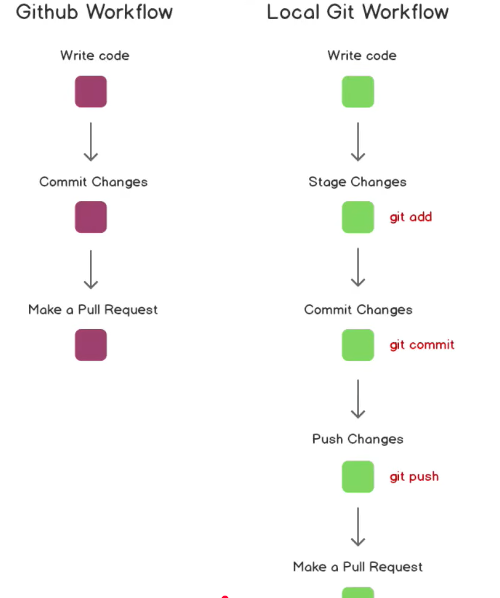
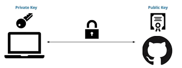

# devops-study-git
devops-study-git
# Project Title

A brief description of your project and what it does.

## Table of Contents (Optional)
- [GitWorking](#GitWorking)
- [Imp-links](#Imp-links)
- [GitCammands](#GitCammands)
<!-- - [Contributing](#contributing)
- [License](#license) -->

## GitWorking
A detailed GitWorking 


## Imp-links
1. https://www.youtube.com/watch?v=e9lnsKot_SQ&t=14s&pp=ygUKZ2l0ICA0IG1pbg%3D%3D
2. https://youtu.be/RGOj5yH7evk
## GitCammands
1. Clone the repository:
    ```bash
    git clone https://github.com/AmitBarate07/devops-study-git.git
    ```
2. Git basic cammands 

    ```bash
    git status
    ```
     Explanation:

        When you run the git status command, it will display the following key information:

        1. Current branch:

        The first line of output will indicate the current branch you are on (e.g., On branch main).

        2. Staging area (index):

        It shows files that have been modified and are staged (ready to be committed). Files staged for commit will appear under a section like:
3. **Stage your changes**:
   - Once you've made changes, use `git add` to stage them for commit:
     ```bash
     git add <file>          # Stage a specific file
     git add .               # Stage all modified files
     ```
   - The `git add` command moves your changes to the staging area, preparing them to be committed.

4. **Commit your changes**:
   - After staging your changes, commit them with a message using `git commit -m`:
     ```bash
     git commit -m "Descriptive message about your changes"
     ```
   - This will create a new commit with the changes you've made and the message you provided. The commit message should be concise and explain what the changes are.

5. **Push your changes**:
   - Finally, push your committed changes to the remote repository using `git push`:
     ```bash
     git push origin main      # Pushes changes to the 'main' branch
     git push origin feature-1 # Pushes changes to a specific feature branch
     ```
   - The `git push` command uploads your local commits to the remote repository, making them available to others.

6. **workflow**
A detailed Git Workflow


7. Git Remote Commands

    **Purpose**: Displays the URLs of the remote repositories associated with your local repository.
    ```bash
    git remote -v
    ```
8. **Checkout a Branch:**
  - To switch to an existing branch, you can use the following git checkout command:
      ```bash
    git checkout <branch-name>
    ```
 - To create a new branch and immediately switch to it, you can use either:
        ```bash
    git checkout -b <new-branch-name>
    ```

9. **switch  a Branch:**
  - The git switch command was introduced in Git 2.23 as a more user-friendly way to handle branch switching.
      ```bash
    git switch <branch-name>

    ```
10. **Git Diff:**
  - git diff – Shows unstaged changes in the working directory.

   - git diff --cached – Shows changes staged for the next commit.

    - git diff <commit1> <commit2> – Compares two commits.

   - git diff <branch1> <branch2> – Compares two branches.

   - git diff <commit> – Compares a specific commit with the working directory.

    - git diff <file-name> – Compares changes for a specific file.
11. **Merge a Feature Branch into the Current Branch**
    - First, ensure you are on the branch that you want to merge into (e.g., main):
    ```bash
        git checkout main

    ```
    - Then, merge the feature branch (e.g., feature-branch) into the current branch:
    ```bash
        git merge feature-branch

    ```
12. **Add key into github**
```bash
    ssh-keygen -t ed25519 -C "akb0103.official@gmail.com" -f ~/.ssh/github
    cat ~/.ssh/github.pub

   
```
- This creates:
- Private key: ~/.ssh/github
- Public key: ~/.ssh/github.pub
- Add SSH key to GitHub
```bash
Go to GitHub → Settings → SSH and GPG keys

    Click New SSH key

    Fill details:

    Title: github

    Key type: Authentication Key

    Key: Paste copied public key

    Click Add SSH key
```



